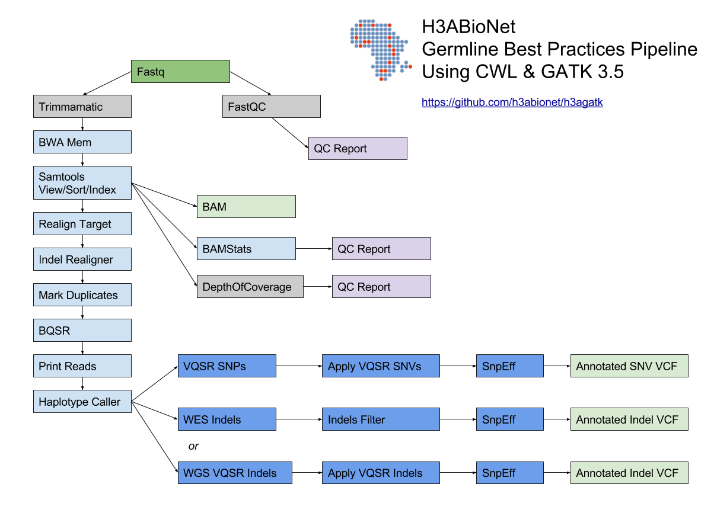

# H3ABioNet GATK Germline Workflow

# Overview
A [GATK best-practices](https://software.broadinstitute.org/gatk/best-practices/bp_3step.php?case=GermShortWGS) germline workflow designed to work with GATK 3.5  (Van der Auwera et al., 2013).

More details can be found in our [Google doc](https://docs.google.com/document/d/1siCZrequI4plggz3ho351NnX57CoyCJl9GWp3azlxfU/edit#).

See our [Trello board](https://trello.com/b/pcWKqbXv/stream-b-ngs-variant-calling-illumina) for more information about our development process.

## Authors

* Mustafa Alghali
* Hocine Bendou
* Michael Crusoe and the CWL tool/workflow contributors (see individual CWL docs for authorship)
* Peter van Heusden
* Phelelani Mpangase
* Brian O'Connor
* Yassine Souilmi

# Workflow Summary



Original diagram document  [here](https://docs.google.com/drawings/d/18OllHlrp4StnNKY1IGB7svt6fMP32-SylRsYOk64QmM/edit).

Gray items can be optionally executed outside of the workflow as stand-alone tools.  Indels can be recalibrated with VQSR or simply filtered depending on the number of indels being analyzed.

# Dependencies

The workflow relies on the following requirements.

## System Resources

We have tested on a 16 core, 128GB+ Ubuntu VM running on Azure.  Similar systems should work.  We recommend 1TB+ disk space if processing a 30x coverage genome, about 500G if processing an exome.  We use the directories `/data/working` and `/data/output` in the examples below but whatever you choose make sure these are on volumes with plenty of space free.

## System Services

Make sure you have installed the following on your Linux system:

* [Docker](https://www.docker.com/)
* [cwltool](https://github.com/common-workflow-language/cwltool)

To install `cwltool`:

```
pip install setuptools==28.8.0
pip install cwl-runner cwltool==1.0.20170217172322 schema-salad==2.2.20170222151604 avro==1.8.1
```

Alternatively, you can use the Dockstore command line, see the Dockstore [install guide](https://dockstore.org/onboarding) for more information.

# Sample Data

We use two test datasets for this workflow.  The first is a small NA12878 exome that takes about 8 hours to run on a 16 core box.

## Exome

GIAB provides an exome from Garvin for NA12878 which is available using the `test/prepare_test.sh` script.  See ftp://ftp-trace.ncbi.nlm.nih.gov/giab/ftp/data/NA12878/Garvan_NA12878_HG001_HiSeq_Exome/ to download fastq pairs.

## Whole Genome

GIAB also provides a 300x coverage genome for NA12878 from the Garvin, see ftp://ftp-trace.ncbi.nlm.nih.gov/giab/ftp/data/NA12878/NIST_NA12878_HG001_HiSeq_300x/ to download fastq pairs.

# Reference Files

The reference files are pulled from the GATK bundle v2.8 (hg19). The used files are:
  - Human reference genome hg19
  - dbSNP build 138
  - HapMap reference data
  - 1000 genome SNPs and indels
  - 1000 genome Omni
  - Mills 1000 genome gold standard variants

These can be downloaded with the `test/prepare_test.sh` script.

# Running

We use the CWL reference implementation with the `cwltool`.  The following shows how to run the whole exome workflow with a working directory of `/data/working` and output going to `/data/output`. This assumes you have downloaded the exome test data and reference files using the `test/prepare_test.sh` script.

```
cwltool --debug --tmpdir-prefix /data/working --outdir /data/output --tmp-outdir-prefix /data/working GATK-complete-WES-Workflow-h3abionet.cwl GATK-complete-WES-Workflow-h3abionet.json  > >(tee stdout.exome.log) 2> >(tee stderr.exome.log >&2)
```

Alternatively you can use the Dockstore command line to execute the workflow.

## Launch a cloud VM: e.g. AWS EC2
The user can run the workflow on any Unix-like platform, given that all the depenedencies are satisfied. For example the user can launch an EC2 instance. There are several ways to do so:

1- Through AWS web console:[AWS own documentation](https://aws.amazon.com/getting-started/tutorials/launch-windows-vm/), or Connor Leech's excellent step by step [guide](https://medium.com/@connorleech/how-to-launch-an-ec2-instance-de568295205d).

2- [AWS CLI](https://docs.aws.amazon.com/cli/latest/userguide/cli-ec2-launch.html).

3- [StarCluster](http://star.mit.edu/cluster/)

You can follow the instructions above to get the pipeline up and running.

# Output

Here's the sample output, your output paths will differ depending on your system.

```
{
    "output_printReads": {
        "checksum": "sha1$ae24bdbb2aa253a217f181af13e91993f3df2d0c",
        "basename": "PrintReads-2017-04-23.bam",
        "location": "file:///mnt2/PrintReads-2017-04-23.bam",
        "path": "/mnt2/PrintReads-2017-04-23.bam",
        "class": "File",
        "size": 18211753946
    },
    "output_SnpVQSR_annotated_snps": {
        "checksum": "sha1$b79dd0de9da7b2ea13c8129c2ad2e6fd0f1c79ff",
        "basename": "HaplotypeCaller-2017-04-23.SNP.vqsr.ann.vcf",
        "location": "file:///mnt2/HaplotypeCaller-2017-04-23.SNP.vqsr.ann.vcf",
        "path": "/mnt2/HaplotypeCaller-2017-04-23.SNP.vqsr.ann.vcf",
        "class": "File",
        "size": 214860597
    },
    "output_IndelFilter_annotated_indels": {
        "checksum": "sha1$3cdd41a1b6c683813e29822854981431b74793e4",
        "basename": "filtered.indels.ann.vcf",
        "location": "file:///mnt2/filtered.indels.ann.vcf",
        "path": "/mnt2/filtered.indels.ann.vcf",
        "class": "File",
        "size": 31696522
    },
    "output_bamstat": {
        "format": "http://edamontology.org/format_3615",
        "checksum": "sha1$0cbb6ba1fc6182bd9c6d279fed07993ca2fee86e",
        "basename": "bamstats_report.zip",
        "location": "file:///mnt2/bamstats_report.zip",
        "path": "/mnt2/bamstats_report.zip",
        "class": "File",
        "size": 2507012
    },
    "output_SnpVQSR_recal_File": {
        "checksum": "sha1$861151b0c967466ce914bf1e2d09dd6e77030c02",
        "basename": "vqsr_recal.snps.recal",
        "location": "file:///mnt2/vqsr_recal.snps.recal",
        "path": "/mnt2/vqsr_recal.snps.recal",
        "class": "File",
        "size": 31796999
    },
    "output_HaplotypeCaller": {
        "checksum": "sha1$9a8264fc177950bfdec1b8e6aaf3484458166581",
        "basename": "HaplotypeCaller-2017-04-23.vcf",
        "location": "file:///mnt2/HaplotypeCaller-2017-04-23.vcf",
        "path": "/mnt2/HaplotypeCaller-2017-04-23.vcf",
        "class": "File",
        "size": 93031041
    }
}
```

With the runtime being approximately 7 hours on a 16 core VM.

```
real    407m37.153s
user    3m37.612s
sys     2m16.264s
```

# Release

Releases can be found on the GitHub [releases](https://github.com/h3abionet/h3agatk/releases) page.

The workflow is also published to the Dockstore [here](https://dockstore.org/workflows/h3abionet/h3agatk).

# Workflow Tool Details

## FastQC
FastQC is used as an initial QC step where the input files are checked for usual metrics such as:
	- Read length
	- Reads distribution
	- GC content
	- ...

## Trimmomatic
Trimmomatic is the entry point of the pipeline, it is used to cleanup the reads in the input fastq files from any sequencing adaptors.

## BWA
[BWA](http://bio-bwa.sourceforge.net) is used to align the reads from the the input fastq files -paired-ends- (Li, 2013). We use specifically `bwa mem` as recommended by the [GATK best-practices](https://software.broadinstitute.org/gatk/best-practices/bp_3step.php?case=GermShortWGS). BWA produces a SAM file containing the aligned reads against the human reference genome (hg19, GATK bundle build 2.8).

As GATK tools downstream requires properly formatted Read Group information. We add by default 'toy' Read Group information while processing the alignment to the output SAM file. we specifically use the flag `-R '@RG\tID:foo\tSM:bar\tLB:library1'`.

## SAMtools
[SAMtools](http://www.htslib.org) (Li et al., 2009) are used few times in the pipeline:
	1. Convert BWA's output from a SAM format to a BAM format
	2. Sort the reads in the generated BAM file in step 1 (above)
	3. Indexing the BAM file for the following tools to use

## Picard
[Picard tools](https://broadinstitute.github.io/picard/) are used to mark duplicated reads in the aligned and sorted BAM file, making thus the files lighter and less prone to errors in the downstream steps of the pipeline.

## GATK
[Genome Analysis Tool Kit](https://software.broadinstitute.org/gatk) refered to as GATK (DePristo et al., 2011) is used to process the data throught multiple steps as described by the [GATK best-practices](https://software.broadinstitute.org/gatk/best-practices/bp_3step.php?case=GermShortWGS) (i.e. figure bellow).

The GATK steps are the following:
	1. Indel Realignment:
		1. [Realign Target Creator](https://software.broadinstitute.org/gatk/documentation/tooldocs/org_broadinstitute_gatk_tools_walkers_indels_RealignerTargetCreator.php)
		2. [Indel Realigner](https://software.broadinstitute.org/gatk/documentation/tooldocs/org_broadinstitute_gatk_tools_walkers_indels_IndelRealigner.php)
	2. Mark Duplicates (a picard step)
	3. Base Quality Score Recalibration (BQSR):
		1. [Base Recalibrator](https://software.broadinstitute.org/gatk/documentation/tooldocs/org_broadinstitute_gatk_tools_walkers_bqsr_BaseRecalibrator.php)
		2. [Print Reads](https://software.broadinstitute.org/gatk/documentation/tooldocs/org_broadinstitute_gatk_tools_walkers_readutils_PrintReads.php)
	4. [Haplotype Caller](https://software.broadinstitute.org/gatk/documentation/tooldocs/)
	5. Variant Quality Score Recalibration (VQSR):
		1. [Variant Recalibrator](https://software.broadinstitute.org/gatk/documentation/tooldocs/org_broadinstitute_gatk_tools_walkers_variantrecalibration_VariantRecalibrator.php)
		2. [Apply Recalibration](https://software.broadinstitute.org/gatk/documentation/tooldocs/org_broadinstitute_gatk_tools_walkers_variantrecalibration_ApplyRecalibration.php)

## SnpEff
SnpEff is used in this pipeline to annotate the variant calls (Cingolani et al., 2012). The annotation is extensive and uses multi-database approach to provide the user with as much information about the called variants as possible.

## BAMStat
[BAMStats](http://bamstats.sourceforge.net), is a simple software tool built on the Picard Java API (2), which can calculate and graphically display various metrics derived from SAM/BAM files of value in QC assessments.


# TODO

See our [Trello board](https://trello.com/b/pcWKqbXv/stream-b-ngs-variant-calling-illumina) for more information.

- [ ] streaming between steps to improve throughput, currently not supported via the reference implementation
   - [ ] need to stream between samtools/bwa steps for performance
- [ ] properly configuring/exposing threads per step to maximize speed of the steps, really need to refer to [GATK's guidelines](http://gatkforums.broadinstitute.org/gatk/discussion/1975/how-can-i-use-parallelism-to-make-gatk-tools-run-faster) for this since each tool has an optimal setting.
- [ ] remove the dictionary creation steps
- [ ] clearly document the reference files needed
- [ ] dealing with the CWL input file directory being not writable (this prevents GATK from making VCF index files on the fly). The error looks like this: `WARN  09:30:55,672 RMDTrackBuilder - Unable to write to /var/lib/cwl/stg24cab595-694a-4cac-b90a-abe40abdeaa2/Mills_and_1000G_gold_st.vcf.idx for the index file, creating index in memory only`
- [ ] adding SV and CNV calling tools to the workflow
 	 - [ ] CNV: [CNVnator](http://sv.gersteinlab.org/)
 	 - [ ] SV: [Delly2](https://github.com/tobiasrausch/delly)
- [ ] adding Oncotator and Annovar for annotation (have SNPEff)
- [ ] report error back to CWLTools where schemas are loaded on each run (should be cached) and if there's a failure to retrieve an 'utf8' decoding error is reported.
- [ ] output cleanup, we don't need to save all the files the workflow currently does
- [ ] zip file for DepthOfCoverage
- [ ] need to stream between samtools/bwa steps for performance
- [ ] add scatter/gather based on chr to the workflow
- [ ] DepthOfCoverage need to have the input from view and sort steps in the same directory (e.g. the bam and bai need to be mounted in the same directory). CWL puts each input on it's own path and these are read only.  Michael is going to help us work around this.  In the mean time, DepthOfCoverage is commented out
- [ ] Properly make and pass around the .idx files since many of the tools
- [ ] multiple fastq sets as input needs to be supported


### References

To cite this pipeline, please use:

Baichoo, S., Souilmi, Y., Panji, S., Botha, G., Meintjes, A., Hazelhurst, S., Bendou, H., Beste, E. de, et al. 2018. Developing reproducible bioinformatics analysis workflows for heterogeneous computing environments to support African genomics. BMC Bioinformatics. 19(1):457. DOI: [10.1186/s12859-018-2446-1](https://doi.org/10.1186/s12859-018-2446-1).
